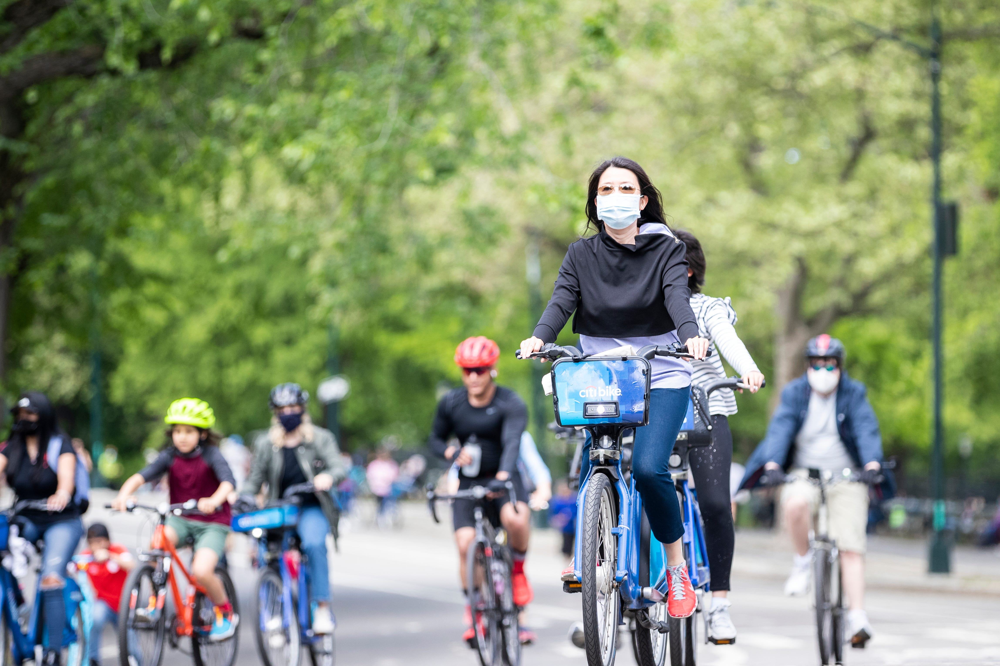

{height=75%, width=75%}

## Introduction
This part examines how riding behaviors in Jersey City changed before and during the COVID-19 pandemic. Using trip-level data, we evaluate two key behavioral indicators—riding time and riding distance—across different age groups(from 18 to 64) and months. The analysis highlights how mobility patterns shifted in response to the pandemic, particularly when PCR testing requirements, reduced subway usage, and the high perceived infection risk on public transportation increased reliance on cycling as a safer and more flexible mode of travel. By comparing monthly trends across years and age groups, we aim to understand how public-health disruptions influenced urban transportation behavior.

## Figure 1 and 2
```{r, message = FALSE}
library(tidyverse)
library(geosphere)
library(patchwork)

bike_df = read.csv("data/bike_data_combined.csv")

bike_year_distance =
  bike_df |>
  mutate(
    age = year - birth_year,
    distance_m = distHaversine(
      cbind(start_station_longitude, start_station_latitude),
      cbind(end_station_longitude,   end_station_latitude))) |>
  mutate(distance_km = distance_m / 1000) |>
  mutate(
    age_group = cut(
      age,
      breaks = c(-Inf, 17, 29, 49, 64, Inf),
      labels = c("<18", "18–29", "30–49", "50–64", "65+"),
      right = TRUE
    )
  ) |>
  filter(age_group != "<18" & age_group != "65+") |>
  filter(tripduration < 100000 & tripduration > 0) |>
  filter(distance_km < 100 & distance_km > 0) |>
  select(year,month,tripduration,age_group,distance_km,distance_m)

bike_time =
  bike_year_distance |>
  mutate(year = factor(year),
         month = factor(
      month,
      levels = c("Jan", "Feb", "Mar", "Apr", "May", "Jun",
                 "Jul", "Aug", "Sep", "Oct", "Nov", "Dec")
    )) |>
  group_by(year,month,age_group) |>
  summarise(time = mean(tripduration))

biketime_plot1=
  ggplot(bike_time, 
       aes(x = age_group, y = time, fill = year)) +
  geom_col(position = "dodge") +
  facet_wrap(~ month, ncol = 4) +
  labs(
    title = "Monthly Comparison of Riding Time Across Age Groups (2019 vs 2020)",
    x = "Age Group",
    y = "Average Riding Time (seconds)",
    fill = "Year"
  ) +
  theme_minimal(base_size = 12) +
  theme(
    axis.text.x = element_text(angle = 40, hjust = 1)
  )

biketime_plot1
```
```{r, message = FALSE}
biketime_plot2=
  ggplot(
  bike_time,
  aes(x = month, y = time, color = age_group, group = age_group)
) +
  geom_line(linewidth = 1.1) +
  geom_point(size = 2.5) +
  facet_grid(. ~ year) + 
  labs(
    title = "Monthly Riding Time by Age Group (2019 vs 2020)",
    x = "Month",
    y = "Average Riding Time (seconds)",
    color = "Age Group"
  ) +
  theme_minimal(base_size = 12) +
  theme(
    axis.text.x = element_text(angle = 40, hjust = 1)
  )
biketime_plot2
```

The two plots show that riding time increased across all age groups in 2020, especially during April–July, compared with the same months in 2019. The increase is largest for the 50–64 group, indicating greater avoidance of public transit among older adults during the early pandemic. All age groups show sustained increases throughout 2020, suggesting broader shifts toward outdoor and low-risk travel.

## Figure 3 and 4
```{r, message = FALSE}
bike_distance = bike_year_distance |>
  filter(distance_km < 100 & distance_km > 0) |>
  mutate(year = factor(year),
         month = factor(
      month,
      levels = c("Jan", "Feb", "Mar", "Apr", "May", "Jun",
                 "Jul", "Aug", "Sep", "Oct", "Nov", "Dec")
    )) |>
  group_by(year,month,age_group) |>
  summarise(distance = mean(distance_m))

bikedistance_plot1=
  ggplot(bike_distance,
       aes(x = age_group, y = distance, fill = year)) +
  geom_col(position = "dodge") +
  facet_wrap(~ month, ncol = 4) +
  labs(
    title = "Monthly Comparison of Riding Distance Across Age Groups \n(2019 vs 2020)",
    x = "Age Group",
    y = "Average Riding Distance (m)",
    fill = "Year"
  ) +
  theme_minimal(base_size = 12) +
  theme(
    axis.text.x = element_text(angle = 40, hjust = 1)
  )

bikedistance_plot1
```
```{r, message = FALSE}
bikedistance_plot2=
  ggplot(
  bike_distance,
  aes(x = month, y = distance, color = age_group, group = age_group)
) +
  geom_line(linewidth = 1.1) +
  geom_point(size = 2.5) +
  facet_wrap(~ year, nrow = 1) +  
  labs(
    title = "Monthly Riding Distance by Age Group (2019 vs 2020)",
    x = "Month",
    y = "Average Riding Distance (m)",
    color = "Age Group"
  ) +
  theme_minimal(base_size = 12) +
  theme(
    axis.text.x = element_text(angle = 40, hjust = 1)
  )

bikedistance_plot2

```

```{r, echo=FALSE, fig.show='hide'}
(biketime_plot2 / bikedistance_plot2) + plot_layout(heights = c(1, 1)) 
ggsave("bike_time_distance_combined.png", width = 8, height = 10, dpi = 300)
```


Riding distance in 2020 is consistently higher than in 2019 across all age groups and nearly all months. The most pronounced increases occur during April–August, when many residents replaced subway and bus travel with longer bike trips for commuting, testing visits, and outdoor activities. The patterns are similar across age groups, demonstrating a city-wide behavioral shift. The line chart shows all groups experience a sharp rise beginning in March–April 2020, matching the timing of COVID-19 disruptions. Distances remain elevated through late 2020, illustrating how cycling became a sustained alternative to public transportation during the pandemic.

## Summary
Across age groups, older riders tended to have longer riding times but shorter distances, indicating slower cycling speeds, whereas younger riders showed shorter times but longer distances, reflecting faster riding speeds.

Beginning in March–April 2020, both riding distance and riding time increased sharply across all age groups compared with 2019. This shift aligns with the early COVID-19 outbreak, when PCR testing requirements and the high infection risk associated with public transportation led many people to avoid subways and buses. As a result, cycling became a safer and more reliable choice for traveling. Our findings are consistent with prior research showing that pandemic-related transit capacity restrictions pushed many users toward non-car modes such as biking and Citi Bike; as Wang, Ding et al. (2021) noted, “the transit capacity restriction would shift most users to non-car modes, e.g., bike and Citi Bike”.

### Reference
Wang, Ding, et al. "Impact of COVID-19 behavioral inertia on reopening strategies for New York City transit." International Journal of Transportation Science and Technology 10.2 (2021): 197-211.
